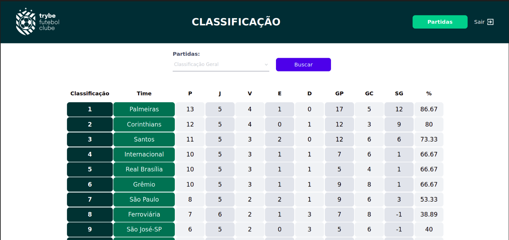
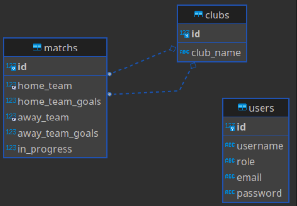

# TFC - Trybe Futbol Club




O projeto simula uma aplicação responsável pela série A do fictício TFC - Trybe Futebol Clube.
Nesse projeto eu desenvolvi todo o backend e o Banco de Dados, de uma aplicação com o frontend já pronto, modelei os dados com MySQL através do Sequelize, fiz testes de integração utilizando chai/sinon e "dockerizei" a aplicação e "orquestrei" os conteines.



### Ajustes e melhorias

O projeto ainda está em desenvolvimento e as próximas atualizações serão voltadas nas seguintes tarefas:

- [ ] Melhorar a estrutura da aplicação
- [ ] Melhorar os testes de integração
- [ ] Produzir testes unitários.

## 💻 Pré-requisitos

Antes de começar, verifique se você atendeu aos seguintes requisitos:

* Para o projeto rodar corretamente, é necessário ter instalado a versão 16 do node, Docker e o docker-compose.


## 🚀 Instalando TFC - Trybe Futebol Club

Para instalar o TFC- trybe Futebol CLub, siga estas etapas:
(sistema operacional linux)

Abra seu terminal <ctrl> + <alt> + <t>
  
Clone o repositório:
```
git clone https://github.com/isadorabayma/TrybeFutebolClube.git
```
Entre na pasta do repositório que você acabou de clonar:
 ```
cd trybe-futebol-clube
  ```
Instale as dependências:
 ```
npm install
  ```
  
Para rodar o docker-compose:
  ```
  npm run compose:up
  ```
Agora é só acessar seu [localhost:3000](http://localhost:3000) 
 
Projeto desenvolvido durante o curso da [Trybe](https://github.com/tryber).
